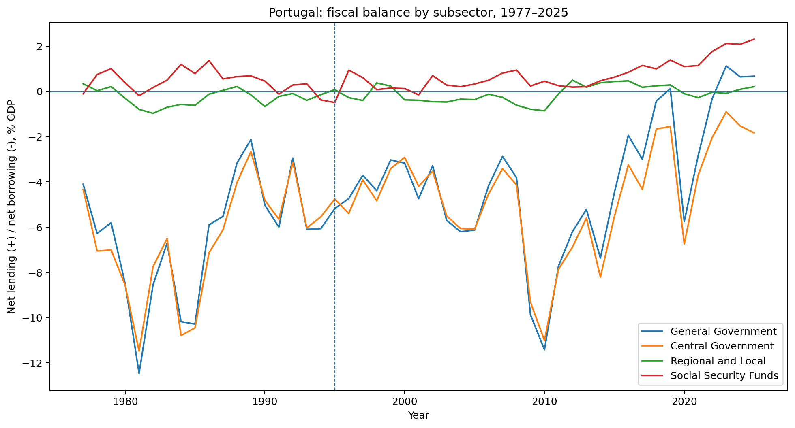
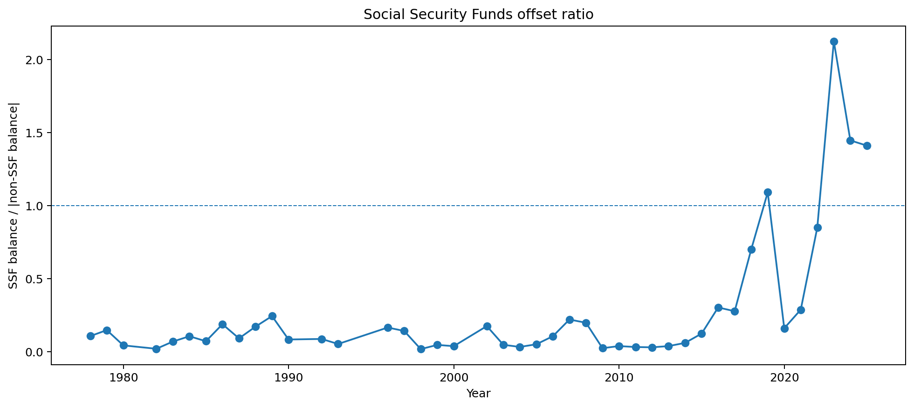
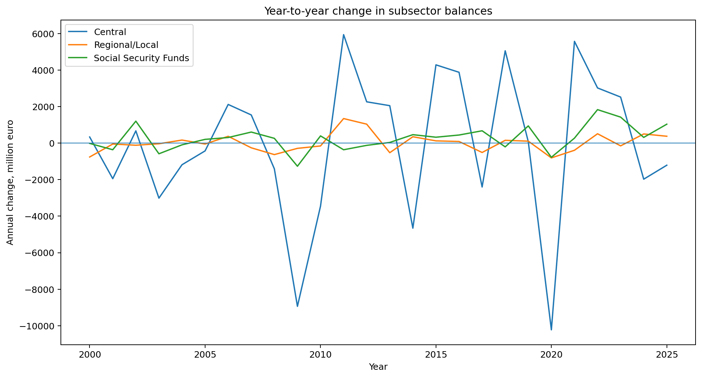
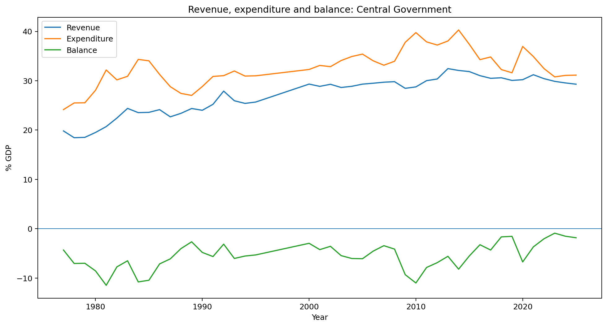
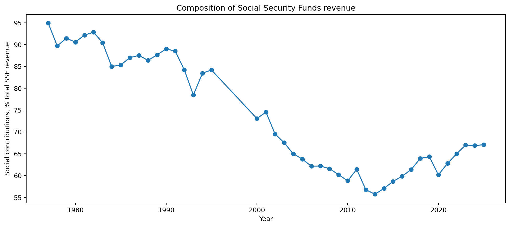
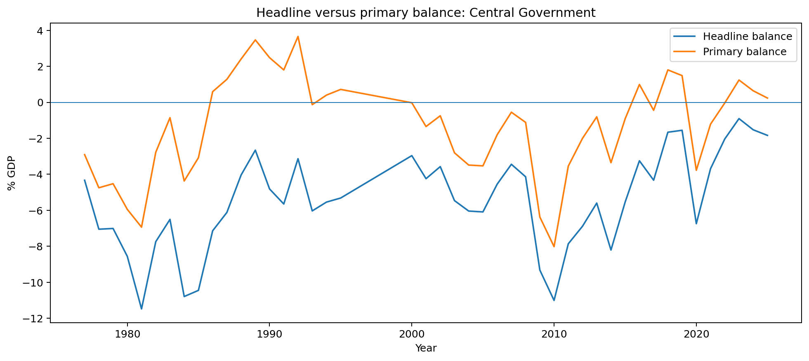
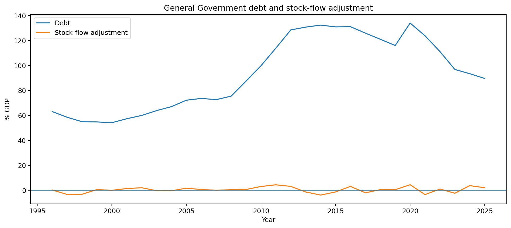

# Portugal's General-Government Balance by Subsector, 1977–2025

## Abstract

This report decomposes Portugal's annual general-government net lending (+) / net borrowing (-) into Central Government, Regional and Local Government, and Social Security Funds (SSF). The analysis is empirical and accounting-focused. It studies long-run balance composition, year-to-year attribution, revenue and expenditure dynamics, persistence, structural mean shifts, Social Security revenue composition, primary balances, public investment, debt-flow reconciliation, and descriptive macroeconomic co-movement.

The central accounting identity is

\[
B^{GG}_t = B^{C}_t + B^{RL}_t + B^{SSF}_t.
\]

No causal, normative, or policy-intent interpretation is assigned to this identity.

## 1. Data and reproducibility

The balance panel covers **1977–2025**, or **49 annual observations**. Historical data come from the Banco de Portugal / INE long series. The continuous modern balance bridge uses INE data distributed through PORDATA, while the CFP ESA 2010 workbooks provide modern revenue, expenditure, interest, investment, debt and stock-flow data.

The known statistical splice at **1995** is retained explicitly. No smoothing is applied across it. Detailed subsector revenue/expenditure accounts are available for 1977–1995 in the historical source and 2000–2025 in the modern CFP source; **1996–1999 are therefore left missing rather than imputed**.

| Sector | First year | Last year | Observations |
| --- | --- | --- | --- |
| central_government | 1977 | 2025 | 45 |
| general_government | 1977 | 2025 | 49 |
| regional_local_government | 1977 | 2025 | 45 |
| social_security_funds | 1977 | 2025 | 45 |

The maximum absolute subsector closure error in the canonical balance panel is **1.00 M€**. The maximum revenue-minus-expenditure account identity error is **0.000000 M€**. The modern debt-flow reconciliation closes with a maximum absolute error of **0.000000 M€**.

## 2. Long-run subsector decomposition



Across the full 1977–2025 balance panel, the aggregate General Government balance is positive in **4 years: 2019, 2023, 2024, 2025**. The table below reports sign persistence and balance magnitudes by subsector.

| Sector | N | Positive years | Negative years | Mean (% GDP) | Median (% GDP) | Longest positive run | Longest negative run |
| --- | --- | --- | --- | --- | --- | --- | --- |
| general_government | 49 | 4 | 45 | -4.915 | -5.028 | 3 | 42 |
| central_government | 49 | 0 | 49 | -5.381 | -5.396 | 0 | 49 |
| regional_local_government | 49 | 18 | 31 | -0.157 | -0.124 | 8 | 12 |
| social_security_funds | 49 | 43 | 6 | 0.623 | 0.495 | 24 | 2 |

The Central Government balance is negative in **49 of 49 observations** in the canonical balance series. By contrast, SSF has a positive balance in **43 observations**. These are descriptive frequencies, not counterfactual statements about what the aggregate balance would have been under a different institutional arrangement.

### Positive aggregate-balance years

| Year | GG balance (M€) | Central (M€) | Regional/local (M€) | SSF (M€) | Non-SSF (M€) | SSF offset ratio |
| --- | --- | --- | --- | --- | --- | --- |
| 2019 | 249.000 | -3,331.000 | 604.000 | 2,975.000 | -2,727.000 | 1.091 |
| 2023 | 3,030.000 | -2,447.000 | -243.000 | 5,720.000 | -2,690.000 | 2.126 |
| 2024 | 1,863.000 | -4,424.000 | 256.000 | 6,031.000 | -4,168.000 | 1.447 |
| 2025 | 2,059.000 | -5,636.000 | 630.000 | 7,065.000 | -5,006.000 | 1.411 |

In 2025, the identity is

\[
2059
=
-5636
+
630
+
7065
\quad \text{M€}.
\]

The combined non-SSF balance is **-5006 M€**, while the SSF offset ratio is **1.411**. The ratio is defined as SSF balance divided by the absolute value of the negative non-SSF balance whenever those signs make the ratio meaningful.



## 3. Year-to-year attribution

The annual change in the aggregate balance can be written exactly as

\[
\Delta B^{GG}_t
=
\Delta B^{C}_t
+
\Delta B^{RL}_t
+
\Delta B^{SSF}_t.
\]

The repository stores this decomposition for every adjacent year in `outputs/tables/balance_change_attribution.csv`. This distinguishes the level of a subsector balance from its contribution to an annual improvement or deterioration.



## 4. Revenue and expenditure dynamics

For every sector-year with detailed accounts, the balance is decomposed as

\[
B_{i,t} = R_{i,t} - E_{i,t},
\]

and therefore

\[
\Delta B_{i,t} = \Delta R_{i,t} - \Delta E_{i,t}.
\]

The exact annual decomposition is stored in `outputs/tables/revenue_expenditure_change_decomposition.csv`. Source gaps are not bridged when calculating changes.



## 5. Social Security Funds: revenue composition and internal systems

The long-run SSF account series contains total revenue, total expenditure and social contributions. In 2025, social contributions were **67.07% of total SSF revenue** in the ESA 2010 account table.



The CFP's separate Social Security budget tables provide a second, non-interchangeable view of the system. In 2025, the reported internal balances were:

- Previdential system: **6712 M€**;
- Social Protection of Citizenship system: **-55 M€**;
- Special regimes: **0 M€**.

For the detailed 2025 budget table, previdential contributions account for **92.27%** of previdential revenue. These budget-system figures are analysed separately from the national-accounts SSF balance because the accounting boundaries differ.

## 6. Primary balance and interest

The primary balance is reconstructed as

\[
PB_{i,t} = B_{i,t} + I_{i,t},
\]

where \(I\) is interest expenditure. For Central Government in 2025, the headline balance was **-5636 M€**, interest expenditure was **6364 M€**, and the recomputed primary balance was **728 M€**.



This decomposition isolates the accounting contribution of interest from the remainder of the balance. It is used only to separate interest expenditure from the remaining accounting balance.

## 7. Fixed-capital formation diagnostic

The repository reports an explicitly non-official diagnostic

\[
B^{before\ GFCF}_{i,t} = B_{i,t} + GFCF_{i,t}.
\]

For Central Government in 2025, GFCF was **4828 M€**, and the analytical balance before GFCF was **-808 M€**. This does not redefine the official fiscal balance; it only quantifies the scale of fixed-capital formation relative to B.9.

## 8. Debt and stock-flow adjustment

Debt dynamics need not equal minus the annual B.9 balance. The modern CFP tables allow the reconciliation

\[
\Delta Debt_t = -B_t + SFA_t,
\]

where \(SFA\) is the stock-flow adjustment. In 2025, General Government Maastricht debt was **89.67% of GDP**, and the stock-flow adjustment was **2.03% of GDP**.



## 9. Persistence and structural mean shifts

Structural mean-shift detection is performed separately inside the 1977–1994 historical regime and the 1995–2025 modern regime. This prevents the known 1995 statistical splice from being mistaken for an economic break. A conservative piecewise-constant model with at most two breaks and a minimum five-year segment is selected by BIC.

| regime | sector | n_breaks | break_years | segment_means_pct_gdp |
| --- | --- | --- | --- | --- |
| 1977-1994_historical | general_government | 1 | 1986 | -8.0942;-4.7630 |
| 1977-1994_historical | central_government | 1 | 1987 | -8.1056;-4.7492 |
| 1977-1994_historical | regional_local_government | 0 |  | -0.2750 |
| 1977-1994_historical | social_security_funds | 0 |  | 0.4602 |
| 1995-2025_modern | general_government | 2 | 2009;2015 | -4.3662;-7.9664;-1.4712 |
| 1995-2025_modern | central_government | 2 | 2009;2016 | -4.4779;-7.7736;-2.7526 |
| 1995-2025_modern | regional_local_government | 2 | 2000;2011 | -0.0006;-0.4598;0.1550 |
| 1995-2025_modern | social_security_funds | 2 | 2016;2021 | 0.3522;1.0925;1.8804 |

The detected dates are descriptive model outputs. The repository does not assign historical causes to them automatically.

## 10. Descriptive macroeconomic co-movement

The full-period macroeconomic regression uses **nominal GDP growth**, because that variable can be reconstructed consistently from the bundled sources across 1977–2025. It is deliberately not described as an output gap or as a structural cyclical adjustment. HAC standard errors are used.

| sector | n | r_squared | nominal_gdp_growth_coef | nominal_gdp_growth_se_hac | nominal_gdp_growth_pvalue_hac | modern_regime_coef |
| --- | --- | --- | --- | --- | --- | --- |
| general_government | 48 | 0.1751 | 7.7012 | 8.8215 | 0.3827 | 3.6653 |
| central_government | 48 | 0.1634 | 5.5312 | 7.6465 | 0.4695 | 2.8982 |
| regional_local_government | 48 | 0.0807 | -0.0090 | 0.8348 | 0.9914 | 0.2213 |
| social_security_funds | 48 | 0.0707 | 2.1789 | 2.0029 | 0.2766 | 0.5458 |

For 1978–1995 only, the historical Banco de Portugal / INE workbook also permits a small SSF model using employment growth and the unemployment rate:

| n | r_squared | employment_growth_coef | employment_growth_se_hac | employment_growth_pvalue_hac | unemployment_rate_coef | unemployment_rate_se_hac | unemployment_rate_pvalue_hac |
| --- | --- | --- | --- | --- | --- | --- | --- |
| 18 | 0.2494 | 9.7252 | 5.2069 | 0.0618 | 20.2847 | 8.5997 | 0.0183 |

These regressions quantify co-movement. They are not causal estimates.

## 11. Intergovernmental transfers

Historical source tables identify current and capital transfers received and paid between public administrations. The repository computes a mechanical transfer-reallocation sensitivity:

\[
B^{sens}_{i,t} = B_{i,t} - (T^{received}_{i,t} - T^{paid}_{i,t}).
\]

This is intentionally not labelled an underlying or true balance. Removing a transfer while leaving the associated expenditure responsibility unchanged would generally not define a meaningful counterfactual.

## 12. Methodological limitations

1. **1995 is a known source/methodology splice.** Both historical and modern 1995 values are retained in `data/interim/methodology_overlap_1995.csv`.
2. **Detailed subsector accounts have a 1996–1999 gap.** No interpolation is performed.
3. **Nominal GDP growth is not an output gap.** The full-period co-movement analysis should not be read as a cyclically adjusted balance.
4. **Social Security national accounts and budget-system accounts have different boundaries.** They are never merged into one balance series.
5. **The fixed-investment diagnostic is not an official balance concept.**
6. **Structural-break dates are statistical summaries, not causal event labels.**
7. **All interpretation is restricted to accounting, statistical and economic relationships directly supported by the data.**

## 13. Reproducibility

The repository preserves raw source workbooks, source-specific intermediate CSVs, canonical processed datasets, analysis tables, figures, executed notebooks and SHA-256 hashes of every bundled raw file. The default execution is:

```bash
poetry install
make all
```

The final report is regenerated from persisted analysis outputs rather than from hard-coded conclusions.
